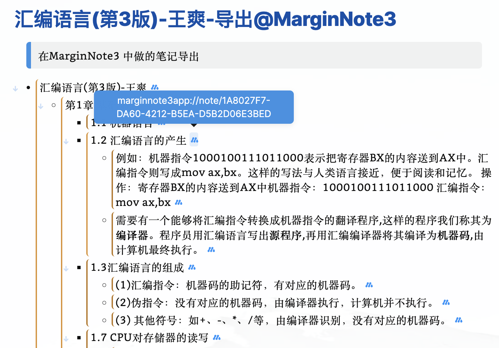

## 汇编语言(第3版)-王爽-导出@MarginNote3

> 在MarginNote3 中做的笔记 Obsidian Bridge 导出，个人整理的，图片缺失，但是可以搜索和查看
> 完整形态是 assets/汇编语言(第3版)-王爽(2022-08-19-20-53-48).marginpkg 和 《汇编语言(第3版)-王爽》.pdf 导入MarginNote3 中，直接跳转查看上下文
> 
> 半完整形态是打开 assets/汇编语言(第3版)-王爽(2022-08-19-21-04-14).ooutline ，需要的软件是OmniOutliner，可以看到图片还有跳转链接

- 汇编语言(第3版)-王爽 
    - 第1章 基础知识 
        - 1.1 机器语言 
        - 1.2 汇编语言的产生 
            - 例如：机器指令1000100111011000表示把寄存器BX的内容送到AX中。汇编指令则写成mov ax,bx。这样的写法与人类语言接近，便于阅读和记忆。 操作：寄存器BX的内容送到AX中机器指令：1000100111011000 汇编指令：mov ax,bx 
            - 需要有一个能够将汇編指令转换成机器指令的翻译程序,这样的程序我们称其为**编译器**。程序员用汇编语言写出**源程序**,再用汇编编译器将其编译为**机器码**,由计算机最终执行。 
        - 1.3汇编语言的组成 
            - (1)汇编指令：机器码的助记符，有对应的机器码。 
            - (2)伪指令：没有对应的机器码，由编译器执行，计算机并不执行。 
            - (3) 其他符号：如+、-、*、/等，由编译器识别，没有对应的机器码。 
        - 1.7 CPU对存储器的读写 
            - 存储单元的地址（地址信息）； 
            - 器件的选择，读或写的命令（控制信息）： 
            - 读或写的数据（数据信息） 
        - 1.8地址总线 
            - 一个CPU有N根地址线，则可以说这个CPU的地址总线的宽度为N。这样的CPU 最多可以寻找2的N次方个内存单元。 
        - 1.9数据总线 
            - CPU与内存或其他器件之间的数据传送是通过数据总线来进行的。数据总线的宽度决定了CPU和外界的数据传送速度。8根数据总线一次可传送一个8位二进制数据（即一个字节)。 
        - 1.13接口卡 
            - 扩展插槽通过总线和CPU相连，所以接口卡也通过总线同CPU相连。CPU可以直接控制这些接口卡，从而实现CPU对外设的间接**控制**。 
        - 1.14各类存储器芯片 
            - 随机存储器 
            - 装有BIOS(Basic Input/Output System,基本输入/输出系统)的ROM 
            - 接口卡上的RAM 
        - 1.15 内存地址空间 
            - 内存地址空间(假想的逻辑存储器) RAM(主存储器) ROM(装有系统BIOS) 主存储器CPU 地址空间RAM(主存储器) 内存条总线显存地址空间RAM(显存ROM(装有显卡BIOS 显卡BIOS ROM 显卡地址空间扩展插槽网卡BIOS ROM 地址空间ROM(装有网卡BIOS 系统BIOS ROM 网卡地址空间扩展插槽其他器件 
            - 地址07FFFH的32KB空间为主随机存储器的地址空间；  地址8000H9FFFH的8KB空间为显存地址空间；  地址A000H~FFFFH的24KB空间为各个ROM的地址空间。 
            - CPU向内存地址为C000H的内存单元中写入数据的操作是没有结果的，**C000H单元中的内容不会被改变**，C000H单元实际上就是**ROM存储器中的一个单元**。 
    - 第2章寄存器 
        - 2.1通用寄存器 
            - 8086CPU的上一代CPU中的寄存器都是8位的，为了保证兼容，使原来基于上代CPU编写的程序稍加修改就可以运行在8086之上，8086CPU的AX、BX、CX、DX这4 个寄存器都可分为两个可独立使用的8位寄存器来用： 
            - AX的低8位(0位~7位)构成了AL寄存器，高8位(8位~15位)构成了AH寄存器。 AH和AL寄存器是可以独立使用的8位寄存器。图2.4展示了16位寄存器及它所分成的两个8位寄存器的数据存储的情况。 
        - 2.3几条汇编指令 
            - 问题2.2 
                - 程序段中的最后一条指令add al,93H,在执行前，al中的数据为C5H,相加后所得的值为：158H,但是l为8位寄存器，只能存放两位十六进制的数据，所以最高位的1丢失，x中的数据为：0058H。(这里的丢失，指的是进位值不能在8位寄存器中保存，但是CPU并不真的丢弃这个进位值， 
                - 此时al是作为一个**独立的8位寄存器来使用**的，和ah没有关系，CPU在执行这条指令时**认为ah和al是两个不相关的寄存器**。不要错误地认为，诸如add al,.93H的指令**产生的进位会存储在ah中**，**add al,93H进行的是8位运算**。 
        - 2.6 8086CPU给出物理地址的方法 
            - 地址加法器采用物理地址=段地址×16+偏移地址的方法用段地址和偏移地址合成物理地址。 
        - 2.9段寄存器 
            - 8086CPU有4个段寄存器：CS、DS、SS、ES。当8086CPU要访问内存时由这4个段寄存器提供内存单元的段地址。 
        - 2.10CS和IP 
            - CS和IP是8086CPU中两个最关键的寄存器，它们指示了CPU当前要读取指令的地址。CS为代码段寄存器，P为指令指针寄存器，从名称上我们可以看出它们和指令的关系。 
            - 8086机中，任意时刻，CPU将CS:IP指向的内容当作指令执行。 
            - 8086CPU的工作过程可以简要描述 
        - 2.11 修改CS、IP的指令 
            - 同时修改CS、IP的内容，可用形如“jmp段地址：偏移地址”的指令完成 
            - jmp某一合法寄存器”指令的功能为：用寄存器中的值修改P 
        - Debug功能 
    - 第3章寄存器（内存访问） 
        - 3.1 内存中字的存储 
            - CPU中，用16位寄存器来存储一个字。高8位存放高位字节，低8位存放低位字节。 
        - 3.5数据段 
            - 如何访问数据段中的数据呢？将一段内存当作数据段，是我们在编程时的一种安排，; 可以在具体操作的时候，用ds存放数据段的段地址，再根据需要，用相关指令访问数据段中的具体单元。; 注意“字节”和“字”的长度区分 
        - 3.6栈 
            - 栈是一种具有特殊的访问方式的存储空间。 
            - 栈有两个基本的操作：入栈和出栈。入栈就是将一个新的元素放到栈顶，出栈就是从栈顶取出一个元素。栈顶的元素总是最后入栈，需要出栈时，又最先被从栈中取出。栈的这种操作规则被称为：LIFO(Last In First Out,.后进先出)。 
        - 3.7 CPU提供的栈机制 
            - 8086CPU提供入栈和出栈指令，最基本的两个是PUSH(入栈)和POP(出栈)。比如，push ax表示将寄存器ax中的数据送入栈中，pop ax表示从栈J顶取出数据送入ax。8086CPU的入栈和出栈操作都是以**字**为单位进行的。 
            - 8086CPU中，有两个寄存器，**段寄存器SS和寄存器SP**,栈顶的段地址存放在SS中，偏移地址存放在SP中。**任意时刻，SS:SP指向栈顶元素**。push指令和pop指令执行时，CPU从SS和SP中得到栈顶的地址。 
            - push ax的执行，由以下两步完成。(1) **SP-SP-2**,SS:SP指向当前栈顶前面的单元，以当前栈顶前面的单元为新的栈顶： (2) 将ax中的内容送入SS:SP指向的内存单元处， SS:SP此时指向新栈顶。 
        - 3.10栈段 
            - 注意，push,pop等栈操作指令，**修改的只是SP**。也就是说，栈顶的变化范围最大为：O~FFFFH。提供：SS、SP指示栈顶；**改变SP后写内存的入栈指令**；**读内存后改变SP的出栈指 令**。这就是8086CPU提供的栈操作机制。 
            - 可见，不管我们如何安排，CPU将内存中的某段内容当作代码，是因CS:P指向了那里；CPU将某段内存当作栈，是因为SS:SP指向了那里。我们一定要清楚，什么是我们的安排，以及如何让CPU按我们的安排行事。要非常清楚CPU的工作机理，才能在控制CPU按照我们的安排运行的时候做到游刃有余。 
        - 实验2用机器指令和汇编指令编程 
            - **中断机制**，它是我们后半部分课程中的一个主题。现在我们只要知道这一点就可以了：**Dbug的T命令在执行修改寄存器SS的指令时，下一条指令也紧接着被执行**。 
            - 可能要再做些实验才能发现其中的规律。如果你在这里就正确回答了这个问题，那么要恭喜你，因为你有很好的悟性。大多数的学习者对这个问题还是比较迷惑的，不过不要紧，因为随着课程的进行，这个问题的答案将逐渐变得显而易见。 
                - 线临时桃愧豆一七指发&的林的. 护行七做更处径做所馆6单秀u明，感冷作6盛治飞发择格时保存2生f试厚中死的匹开应个伦里矣不爱6 
    - 第4章第一个程序 
        - 4.1 一个源程序从写出到执行的过程 
            - 第一步：编写汇编源程序。 
            - 第二步：对源程序进行编译连接 
                - 可执行文件包含两部分内容**程序**（从源程序中的汇编指令翻译过来的机器码)和数据（源程序中定义的数据)**相关的描述信息**（比如，程序有多 大、要占用多少内存空间等) 
                - 操作系统**依照可执行文件中的描述信息**，将可执行文件中**的机器码和数据加载入内存**，并进行相关的初始化（比如设置CS:IP指向第一条要执行的指令），然后由CPU执行程序。 
        - 4.2源程序 
            - 1.伪指令 
                - **segment**和**ends**是一对成对使用的伪指令，这是在写可被编译器编译的汇编程序时，必须要用到的一对伪指令。**segment和ends的功能是定义一个段**，segment说明一个段开 始，ends说明一个段结束。一个段必须有一个名称来标识， 
                - **end**是一个汇编程序的结束标记 
                - 这条伪指令的含义为“假设”。它假设某一段寄存器和程序中的某一个用segment..ends定义的段相关联。 
                - 在程序的开头，用**assumecs**:**codesg**将用作代码段的**段codesg和CPU中的段寄存器cs联系**起来。 
            - 用汇编语言写的源程序，包括**伪指令**和**汇编指令**，我们编程的最终目的是让计算机完成一定的任务。源程序中**的汇编指令组成了最终由计算机执行的程序**，而**源程序中的伪指令是由编译器来处理**的，它们并不实现我们编程的最终目的。 
            - 5.程序返回 
                - mov ax,4c00H int 21H 这两条指令所实现的功能就是程序返回。 
        - 4.9 程序执行过程的跟踪 
            - 在这段内存区的前256个字节中，创建一个称为程序段前缀〔SP) 的数据区，03要利用PSP来和被加载程序进行通信 
            - 现在，我们可以开始跟踪了，用T命令单步执行程序中的每一条指令，并观察每条指令的执行结果，**到了int21,我们要用P命令执行**， 
            - 使用Q命令退出Debug,将返回到command中，因为Debug是由command加载运行的。在DOS中用“debug 1.exe”运行Debug对l.exe进行跟踪时，**程序加载的顺序是**：**command加载Debug**,**Debug加载**l.**exe**。返回的顺序是：从l.exe中的程序返回到 Debug,从Debug返回到command.。 
        - 实验3 编程、编译、连接、跟踪 
    - 第5章[BX灯]和loop指令 
        - 5.1[BX] 
            - inc bx的含义是bx中的内容加1 
        - 5.2LOop指令 
            - 1) (cx)-(cx)1; 
            - ②判断cx中的值，不为0则转至标号s所标识的地址处执行（这里的指令是add ax,ax),如果为零则执行下一条指令（下一条指令是mov ax,4c00h)。 
        - 5.3在Debug中跟踪用Ioop指令实现的循环程序 
            - 我们知道，大于9FFFh的十六进制数据A000H、A001H..C000H、c001H..FFFEH、FFFFH等，在书写的时候都是以字母开头的。而**在汇编源程序中，数据不能以字母开头**，所以要在前面加0。比如，9138在汇编源程序中可以直接写为“9138h”,而A000h在汇编源程序中要写为“0A000h”。 
            - 这里的问题是，我们希望将循环一次执行完。可以使用p命令来达到目的。再次遇到loop指令时，使用p命令来执行，Debug就会自动重复执行循环中的指令，直到(cx)=O为止。具体情况如图5.14所示。 
            - 当然，也可以用g命令来达到目的，可以用“g0016”直接执行到CS:0016处。具体情况如图5.15所示。 
        - 5.5 loop和[bx]的联合应用 
            - 程序5.6 assume cs:code code segment mov ax,offffh 老电司读、嫁山疾告根动到倒mov ds,ax mov bx,0 :初始化ds:bx指向ffff:0 mov dx,0 初始化累加寄存器dx,(dx)=0 mov cx,12 :初始化循环计数寄存器cx,(cx)=12 S: mov al,[bx] mov ah,0 add dx,ax :间接向dx中加上((ds)*16+(bx))单元的数值inc bx ;ds:bx指向下一个单元loop s mov ax,4c00h int 21h code ends end 在实际编程中，经常会遇到，用同一种方法处理地址连续的内存单元中的数据的问题。我们需要用循环来解决这类问题，同时我们必须能够在每次循环的时候按照同一种方法来改变要访问的内存单元的地址。这时，就不能用常量来给出内存单元的地址（比如， [0]、[1]、[2]中，0、1、2是常量)，而应用变量。“mov al,,[bx]”中的bx就可以看作一个代表内存单元地址的变量，我们可以不写新的指令，仅通过改变bx中的数值，改变指令访问的内存单元。 
        - 5.6段前缀 
            - 这些出现在访问内存单元的指令中，用于显式地指明内存单元的段地址的“ds:”“cs:”“ss:”“es:”,在汇编语言中称为段前缀。 
        - 实验4[b]和loop的使用 
            - (2)编程，向内存0：2000：23F依次传送数据0~63(3FH)，程序中只能使用9条指令，9条指令中包括“mov ax,.4c00h”和“int21h”。 
    - 第6章包含多个段的程序 
        - 6.1 在代码段中使用数据 
            - 我们用end 指令指明了程序的入口在标号start处，也就是说 
        - 6.2在代码段中使用栈 
            - :用dw定义16个字型数据，在程序加载后，将取得16个字的:内存空间，存放这16个数据。在后面的程序中将这段:空间当作栈来使用 
        - 6.3 将数据、代码、栈放入不同的段 
            - 段中的数据占N个字节，则程序加载后，该段实际占有的空间 
    - 第7章更灵活的定位内存地址的方法 
        - 7.1 and和or指令 
            - (2)or指令：逻辑或指令，按位进行或运算。 
            - (I)and指令：逻辑与指令，按位进行与运算。 
        - 7.3 以字符形式给出的数据 
        - 7.4大小写转换的问题 
            - anda1,11011111B :将a1中的ASCII码的第5位置为0，变为大写字母 
        - 7.5 [bx+idata] 
        - 7.7 SI和DI 
            - si和di是8086CPU中和bx功能相近的寄存器，si和di不能够分成两个8位寄存器来使用。下面的3组指令实现了相同的功能。 
        - 7.8 [bx+si]和[bx+di 
        - 7.10 不同的寻址方式的灵活应用 
            - 双重循环 
    - 第8章数据处理的两个基本问题 
        - 为了描述上的简洁，在以后的课程中，我们将使用两个描述性的符号g来表示一个寄存器，用sreg表示一个段寄存器。 
        - 8.1 bx、si、di和bp 
        - 8.2 机器指令处理的数据在什么地方 
        - 8.3 汇编语言中数据位置的表达 
        - 8.4寻址方式 
        - 8.5 指令要处理的数据有多长 
        - 8.6 寻址方式的综合应用 
        - 8.7div指令 
            - 连续进行16除法，需要将DX清空 
            - (1)**除数**：有8位和16位两种，在一个rg或内存单元中。 
            - (2)**被除数**：默认放在AX或DX和AX中，如果除数为8位，被除数则为16位，默认在AX中存放；如果除数为16位，被除数则为32位，在DX和AX中存放，DX存 放高16位，AX存放低16位。 
            - (3)**结果**：如果除数为8位，则AL存储除法操作的商，AH存储除法操作的余数：如果除数为16位，则AX存储除法操作的商，DX存储除法操作的余数。 
        - 88伪指令dd 
            - mov ax,datamov ds,ax mov ax,ds:[0] ;**ds:0字单元中的低16位存储在ax中** mov dx,ds:[2];**ds:2字单元中的高16位存储在dx中** div word ptr ds:[4];用dx:ax中的32位数据除以ds:4字单元中的数据 mov ds:[6],ax;将商存储在ds:6字单元中 
        - 8.9dup 
        - 实验7寻址方式在结构化数据访问中的应用 
    - 数据的结构，组织 
    - 第9章转移指令的原理 
        - 9.1操作符offset 
            - 通心粥的元式switch. Mol x,②mo ay,data imp word ptr ds:bx mov 5,0X A尚格比业作钠处理. 叱Oe: mol X,t0片ist ilH mo 0 ay, 像楼M0 ax ,l02oH MpU ds-I0]ax imp over 52、Mwax,IH☑"Mov ax OFFe7 s2 imp over Mov :[2]1以53.m00,lw2H moV 欢，0fe13 jmp over mo0 d4]1X 
        - 9.2jmp指令 
        - 9.3 **依据位移进行转移**的jmp指令 
            - jmp short标号”的功能为：(P)=(IP)+8位位移。 
            - jmp near ptr标号”的功能为：P)=(IP)十l6位位移。 
        - 9.4 转移的目的地址在指令中的jmp指令 
        - 9.5 转移地址在寄存器中的jmp指令 
        - 9.6 转移地址在内存中的jmp指令 
            - (1) jmp word ptr内存单元地址（段内转移） 
            - (2)jmp dword ptr内存单元地址（段间转移） 
        - 9.7jcXz指令 
            - 指令格式：jcxz标号（如果(cx)一0，转移到标号处执行。） 
            - 操作：当(cx)=0时，(P)=(P)+8位位移； 
        - 9.8loop指令 
            - 指令格式：loop标号(cx)(cx)-1,如果(cx)≠0，转移到标号处执行。) 
            - 操作： (1) (cx)=(cx)1; (2) 如果(cx)≠0，(IP)=(P)+8位位移。 
        - 实验9根据材料编程 
    - 第10章CALL和RET指令 
        - 10.1 ret和retf 
        - 10.3 依据位移进行转移的cal指令 
        - 10.4 转移的目的地址在指令中的call指令 
        - 10.7 call和ret的配合使用 
        - 10.8mul指令 
        - 10.9模块化程序设计 
        - 10.10 参数和结果传递的问题 
        - 10.11批量数据的传递 
        - 10.12 寄存器冲突的问题 
        - 实验10编写子程序 
            - 1.显示字符串 
            - 2.解决除法溢出的问题 
            - 3.数值显示 
    - 主要讲了CUP对内存地址空间的使用 
    - 第11章 标志寄存器 
        - 11.1ZF标志 
        - 11.2PF标志 
        - 11.3SF标志 
        - 11.4 CF标志 
        - 11.5OF标志 
        - 定要注意CF和OF的区别：CF是对无符号数运算有意义的标志位，而OF是对有符号数运算有意义的标志位。 
        - 在8086CPU的指令集中，有的指令的执行是影响标志寄存器的，比如，add、sub、mul、div、inc、or、and等，它们大都是运算指令（进行逻辑或算术运算）；有的指令的执行对标志寄存器没有影响，比如，mov、push、pop等，它们大都是传送指令。在使用一条指令的时候，要注意这条指令的全部功能，其中包括，执行结果对标志寄存器的哪些标志位造成影响。 
        - 11.6adc指令 
            - 计算分3步进行： (1) 先将低16位相加，完成后，CF中记录本次相加的进位值； (r2) 再将次高16位和C(来自低16位的进位值)相加，完成后，CF中记录本次相加的进位值； (3)最后高16位和CF(来自次高16位的进位值)相加，完成后，CF中记录本次相加的进位值。 
            - add128:push a ax push cx push si push di sub ax,ax ;将CF设置为0 mov cx,8 s:mov ax,[si] adc ax,[di] mov [si],ax inc sh 为7不号肉.(F张inc si inc di inc di loop s pop di pop si pop CX pop ax ret 
        - 11.7sbb指令 
        - 11.8cmp指令 
            - 指令cmp ax,ax,做(ax)-(ax)的运算，结果为0，但并不在ax中保存，仅影响f1ag的相关各位。指令执行后：zf1,pf1,sf0,cf0,of0。 
        - 11.9 检测比较结果的条件转移指令 
            - 有符号数比较 
            - 下面是常用的根据无符号数的比较结果进行转移的条件转移指令。 
        - 11.10 DF标志和串传送指令 
            - movsb 
            - movsw 
            - 串传送 
            - rep 
            - cld;std 
        - 11.11 pushfz和popf 
        - pushf的功能是将标志寄存器的值压栈，而popf是从栈中弹出数据，送入标志寄存器中。 
        - pushf和popf,为直接访问标志寄存器提供了一种方法。 
        - 11.12 标志寄存器在Debug中的表示 
            - AX=0000 BX=0000 CX=0000 DX=0000 SP=FFEE BP=0000 SI=0000 DI=0000 DS=★*** ES=****SS=★★ C**S=****IP=0100 NV UP EI PL NZ NA PO NC ↑↑↑↑↑↑OF DE SF ZF PF CE 下面列出Debug对我们已知的标志位的表示。 标志值为1的标记值为0的标记of OV NV sf NG PL zf ZR NZ PE cf df DN 
    - 第12章内中断 
        - 中断信息 
        - 中断 
        - 12.1 内中断的产生 
            - (1) 除法错误，比如，执行div指令产生的除法溢出；  (2) 单步执行；  (3) 执行into指令；  (4) 执行int指令。 
            - 8086CPU用称为中断类型码的数据来标识中断信息的来源。中断类型码为一个字节型数据，可以表示256种中断信息的来源。 
            - 中断信息的事件，即中断信息的来源，简称为中断源， 
            - (1)除法错误：0 (2)单步执行：1 
        - 12.3中断向量表 
            - 中断向量表，就是中断处理程序入口地址的列表。 
            - 中断向量表在内存中保存，其中存放着256个中断源所 
            - ,如果使用8086CPU,中断向量表就必须放在0000：00000000：03FF单元中，这是规定，因为8086CPU就从这个地方读取中断向量表。 
            - 所以一个表项占两个字，高地址字存放段地址，低地址字存放偏移地址 
        - 12.4中断过程 
            - CPU在执行完中断处理程序后，应该返回原来的执行点继续执行下面的指令。所以在中断过程中，在设置CS:P之前，还要将原来的CS和P的值保存起来。 
            - (1)(从中断信息中)取得中断类型码：  (2) 标志寄存器的值入栈（因为在中断过程中要改变标志寄存器的值，所以先将其保存在栈中)：  (3) 设置标志寄存器的第8位T℉和第9位F的值为0（这一步的目的后面将介绍）：  (4) CS的内容入栈； 
            - (5) IP 的内容入栈：  (6)从内存地址为中断类型码*4和中断类型码*4+2的两个字单元中读取中断处理程序的入口地址设置P和CS。 
            - 我们更简洁地描述中断过程，如下：  (1) 取得中断类型码N;  (2) pushf  (3) TF=0,  (4) push CS  (5) push IP  (6) (IP)=N*4),(CS)=N*4+2)  在最后一步完成后，CPU开始执行由程序员编写的中断处理程序。 
        - 12.5中断处理程序和iret指令 
        - 12.6 除法错误中断的处理 
            - 当CPU执行div bh时，发生了除法溢出错误，产生0号中断信息，从而引发中断过程，CPU执行0号中断处理程序。 
        - 12.7 编程处理0号中断 
            - 般情况下，从0000：0200至0000：02F℉的256个字节的空间所对应的中断向量表项都是空的，操作系统和其他应用程序都不占用。 
            - 程序12.1中设置中断向量表的代码执行完后，在0号表项中填入了do0的入口地址0：200，此时0：200处的信息，即do0的代码，就变成了0号中断的中断处理程序。 因为当除法溢出（即0号中断）发生时，CPU将执行0：200处的代码。 
        - 12.8安装 
            - 可以使用movsb指令，将do0的代码送入0：200处。程序如下。 assume cs:code code segment start:设置es:di指向目的地址设置ds:si指向源地址设置cx为传输长度设置传输方向为正rep movsb 设置中断向量表mov ax,4c00h int 21h do0:显示字符串"overf1ow!" mov ax,4c00h int 21h code ends end start 
            - 对于用offset do0end-offset do(0,得到do0代码的长度 
        - 12.9do0 
            - 因为在do0程序开始处的“overflow!”不是可以执行的代码，所以在“overflow!”之前加上一条jmp指令，转移到正式的do0程序。当除法溢出发生时， CPU执行0：200处的jmp指令，跳过后面的字符串，转到正式的do0程序执行。 
        - 12.10 设置中断向量 
        - 12.11单步中断 
            - (1) 取得中断类型码1； (2) 标志寄存器入栈，T℉、F设置为0： (3) CS、P入栈： (4) (IP)=(1*4),(CS)=(1*4+2)。 
            - 然后，在使用t命令执行指令时，Debug将TF设置为1，使得CPU工作于单步 
            - 中断方式下，则在CPU执行完这条指令后就引发单步中断，执行单步中断的序，所有寄存器中的内容被显示在屏幕上，并且等待输入命令。 
            - 在进入中断处理程序之前，设置T℉-O。从而避免CPU在执行中断处理程序的时候发生单步中断。这就是为什么在中断过程中有TF=0这个步骤，我们再来看一下中断过程。 
        - 12.12 响应中断的特殊情况 
            - 在执行完向ss寄存器传送数据的指令后，即便是发生中断，CPU也不会响应。这样做的主要原因是，$s:Sp联合指向栈顶，而对它们的设置应该连续完成。如果在执行完设置ss的指令后，CPU响应中断，引发中断过程，要在栈中压入标志寄存器、CS和P的值。而ss改变，sp并未改变，sssp指向的不是正确的栈顶，将引起错误。所以CPU在执行完设置ss的指令后，不响应中断。这给连续设置ss和sp指向正确的栈顶提供了一个时机。 
            - 而在mov ss,ax指令执行后，CPU根本就不响应任何中断，其中也包括单步中断，所以Dbug设置好的用来显示寄存器状态和等待输入命令的中断处理程序根本没有得到执行，所以我们看不到预期的结果。CPU接着向下执行后面的指令ov sp,10h,然后响应单步中断，我们才看到正常的结果。 
        - 实验12 编写0号中断的处理程序 
    - 第13章int指令 
        - 13.1int指令 
            - (1) 取中断类型码n; (2) 标志寄存器入栈，F=0, TF=0: (3) CS、P入栈； (4) (IP)=(n*4),(CS)=(n*4+2). 
        - 13.2 编写供应用程序调用的中断例程 
            - 避免寄存器的冲突。应该注意例程中用到的寄存器的值的保存和恢复。 
        - 13.3 对int、iret和栈的深入理解 
            - 7ch中断例程如下。 lp:push bp mov bp,sp 6死战中.邮dec cx jcxz pret将闭于返0麻伤位add ([bp+21),bx lpret:pop bp 收苏存号5处的iret 
            - 可以利用iret指令，我们将栈中的se的偏移地址加上bx中的转移位移，则栈中的se 的偏移地址就变为了s的偏移地址。我们再使用it指令，用栈中的内容设置CS、IP,从而实现转移到标号s处。 
        - 检测点13.1 
        - 13.5 B1OS和DOS中断例程的安装过程 
        - 13.6 BIOS中断例程应用 
        - 13.7 DOS中断例程应用 
        - 实验13 编写、应用中断例程 
            - (1) 编写并安装it7ch中断例程，功能为显示一个用0结束的字符串，中断例程安装在0：200处。 参数：(dh)=行号，(d)=列号，(cl)颜色，ds:si指向字符串首地址。 
            - (2 编写并安装int7ch中断例程， 功能为完成loop指令的功能参数：(cx)=循环次数，(bx)=位移 
            - (3)下面的程序，分别在屏幕的第2、4、6、8行显示4句英文诗，补全程序。 
    - 第14章端口 
        - 14.1端口的读写 
            - (2)访问端口： 
        - 14.2 CMOS RAM芯片 
            - 128个字节的RAM中，内部实时钟占用**00dh**单元来**保存时间信息**，其余大部分单元用于保存系统配置信息，供系统启动时BIOS程序读取。 
            - (4) 该芯片内部有两个端口，端口地址为70h和71h。CPU通过这两个端口来读写CMOS RAM 
            - (5)70h为地址端口，存放要访问的CMOS RAM单元的地址；71h为数据端口，存放从选定的CMOS RAM单元中读取的数据，或要写入到其中的数据。可见，CPU对CMOS RAM的读写分两步进行，比如，读CMOS RAM的2号单元： 
        - 14.3 shl和shr指令 
            - sl是逻辑左移指令，它的功能为： (1) 将一个寄存器或内存单元中的数据向左移位； (2) 将最后移出的一位写入CF中： (3) 最低位用0补充。 
            - 如果移动位数大于1时，必须将移动位数放在c1中。 
        - 14.4 CMOS RAM中存储的时间信息 
            - BCD码 
        - 实验14访问CMOS RAM 
    - 第15章外中断 
        - 15.1接口芯片和端口 
        - 15.2外中断信息 
            - 1.可屏蔽中断 
                - (1) 取中断类型码n; (2) 标志寄存器入栈，F=0,TF=0; (3) CS、P入栈： (4) (IP)=(n*4),(CS)=(n*4+2) 
                - cli i餐枚中做，正-定机行 **sti**,**设置IF=1**;moy word p r(5:[7H4],7E00H;i置中向多兵 **cli**,**设置F=0**。mov word p竹S:CcW+2],0 
            - 2.不可屏蔽中断 
            - 不可屏蔽中断的中断类型码固定为2，所以中断过程中，不需要取中断类型码。则不可屏蔽中断的中断过程为： 
        - 15.3 PC机键盘的处理过程 
            - 1.键盘输入 
            - 断码=通码+80h 
            - 2.引发9号中断 
        - 3.执行int9中断例程 
            - 是字符键的扫描码，将该扫描码和它所对应的字符码（即ASCⅡ码）送入内存中的BIOS 键盘缓冲区；如果是控制键（比如Ctrl)和切换键（比如CapsLock)的扫描码，则将其转变为状态字节（用二进制位记录控制键和切换键状态的字节）写入内存中存储状态字节的单元； 
            - 0040:17单元存储键盘状态字节，该字节记录了控制键和切换键的状态。键盘状态字节各位记录的信息如下。 
            - 该内存区可以存储15个键盘输入，因为it9中断例程除了接收扫描码外，还要产生和扫描码对应的字符码，所以在BIOS键盘缓冲区 
        - 实验15安装新的int9中断例程 
    - 第16章直接定址表 
        - 16.1描述了单元长度的标号 
            - 我们还可以使用一种标号，这种标号不但表示内存单元的地址，还表示了内存单元的长度，即表示在此标号处的单元，是一个字节单元，还是字单元，还是双字单元。 
            - 这种包含单元长度的标号，可以使我们以简洁的形式访问内存中的数据。 以后，我们将这种标号称为数据标号，它标记了存储数据的单元的地址和长度。 
        - 16.2在其他段中使用数据标号 
            - 我们要在代码段 code 中用 Ah 段中的数据标号 a、 b 访问数 ig, 则必须用 assume 将一个寄存器和 data 段相联, 在程序中, 我们用 da 寄存器和 data 段相联, 
        - 16.3 直接定址表 
            - 利用表，在两个数据集合之间建立一种映射关系，使我们可以用查表的方法根据给出的数据得到其在另一集合中的对应数据。这样做的目的一般来说有以下 3 个。 
        - 16.4 程序入口地址的直接定址表 
            - 我们可以将这些功能子程序的入口地址存储在一个表中，它们在表中的位置和功能号相对应。对应关系为：功能号*2=对应的功能子程序在地址表中的偏移。 
    - 第 17 章使用 BIOS 进行键盘输入和磁盘读写 
        - 17.1 int9中断例程对键盘输入的处理 
            - BIOS的int9中断例程和int16h中断例程是一对相互配合的程序，int9中断例程向键盘缓冲区中写入，it16h中断例程从缓冲区中读出。它们写入和读出的时机不同，int9中断例程是在有键按下的时候向键盘缓冲区中写入数据；而it16h中断例程是在应用程序对其进行调用的时候，将数据从键盘缓冲区中读出。 
        - 17.3 字符串的输入 
        - 17.4 应用 int13h 中断例程对磁盘进行读写 
        - 课程设计2 
    - 附注5公式证明 
    - 拓展 
        - 实模式 
        - 保护模式 