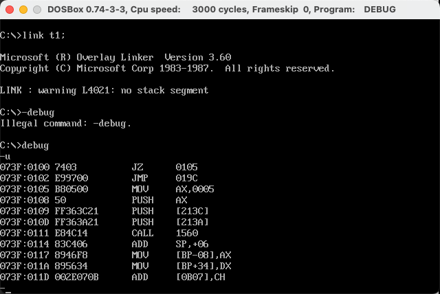
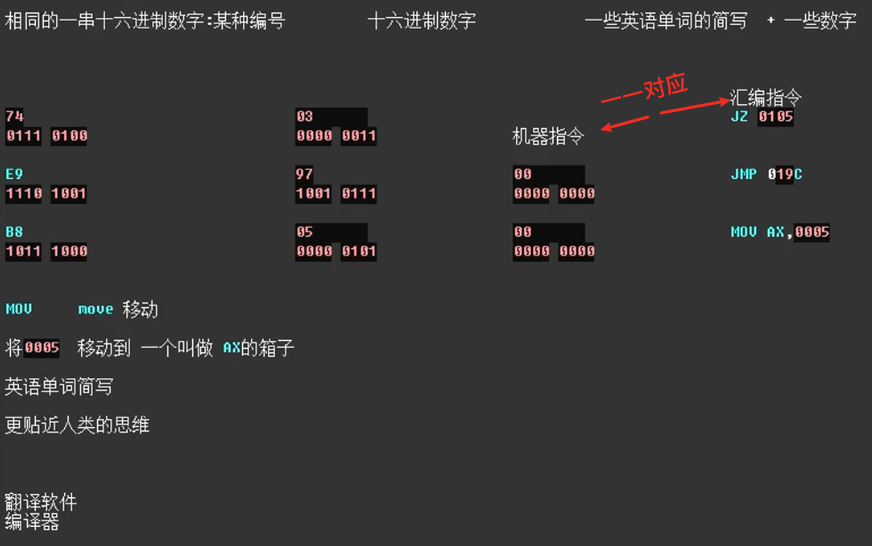
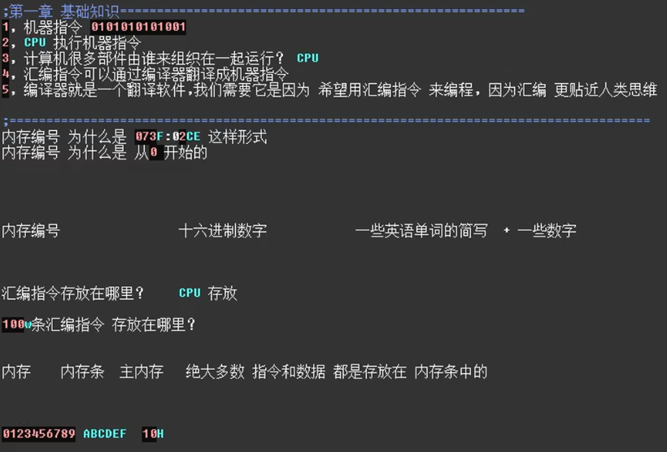
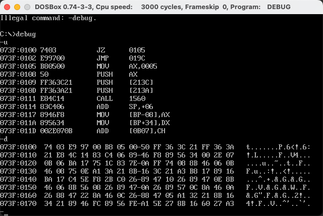
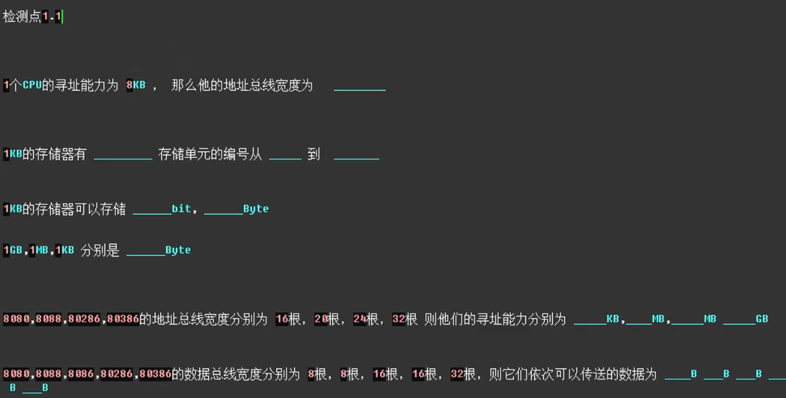
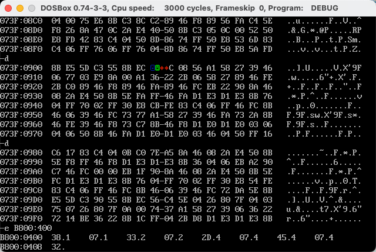
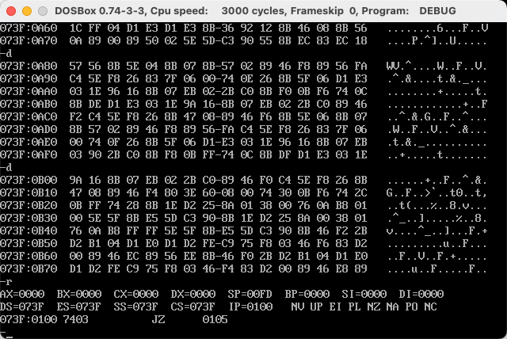
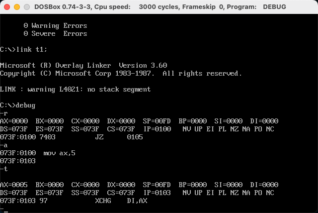
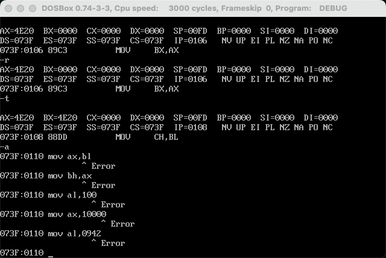

汇编语言从 0 开始 重制版 自学必备(配套王爽汇编语言第三版或第四版)
 [B 站视频](https://www.bilibili.com/video/BV1mt411R7Xv)

> 编码就是人类对世界的表示
> 王爽说的

# DosBox的下载安装与使用

mac 上的配置文件是 ` ~/Library/Preferences/Dosbox 0.74 Preferences`
打开这个文件进行配置就好，

`DOSBox 0.74-3-3 Preferences`  编译脚本
```
mount c: /Users/huxinzhi/Developer/ASM
c:

masm t1;
link t1;
```

添加 `mount c: /Users/huxinzhi/Developer/ASM` （你自动的 debug 目录）
将 debug 的目录挂载到 ` c: ` 下次启动直接自动挂载，还可以把一些编译，链接等工具放到这个目录下

配置目录还有一些设置，fullscreen=false 可以设置为 True 等

ASM 感觉是专门用来编译 用汇编语言写的文件

t1.asm

```
assume cs:code

code segment

        mov bx,0B800H
        mov es,bx
        
        mov bx,160*10 + 40*2

        mov word ptr es:[bx],5535H

        mov ax,4C00H
        int 21H

code ends

end
```


# 导言 目录

```
1,基础知识
2,寄存器
3,寄存器(内存的访问)			 debug 查找错误的工具

编程 访问内存空间

4,第一个程序
5,[BX]和10op指令
6,包含多个程序段
7,更灵活的定位内存地址的方法
8,数据处理的两个基本问题			实验7
9,转移指令的原理
10,CALL 和 RET 指令				课程设计一

11,标志位寄存器					;承上启下的意思 必须要有个 寄存器 去判断某些 事情
12,内中断
13,int指令

通过端口改变内存空间中的内容

14,端口
15,外中断
16,直接定址表
17,使用BIOS进行键盘输入和磁盘读写	课程设计二

18,综合研究						汇编语言和C语言的关系
```


# 第一章 基础知识

```
DOSBOX -debug -u
```






汇编语言

1. 汇编指令	通过编译器 也就是翻译软件 翻译成机器指令机器码
2. 伪指令		告诉编译器也就是翻译软件 你这里怎么翻译那里怎么翻译
3. 符号体系	`+ - * /` 编译器管




```
DOSBOX debug 
-u 
-d
```

u指令和d指令的 解释不同

u指令我们看到的是 机器指令 和 汇编指令 **将某个内存地址开始的字节全部当作指令**

d指令 我们看到的是 数据 **将某个内存地址开始的字节全部当作数据**

同一串 十六进制数字 产生了 2 种解释 `指令` `数据`

内存的最小单元：一个字节 = 2 个十六进制位

1 byte = 8 bit	1 bit = 1 个 2 进制位




CPU 和 内存条 之间 进行联系 需要通过 这些电路

​	内存编号信息	地址线（内存地址）	决定了 CPU 的寻址能力

​	数据信息		数据线		决定了 CPU 的和其他部件进行数据传送时一次性能够传送多少数据的能力

​	读写信息		控制线		决定了 CPU 对其他部件进行控制能力


只有一根地址线物理上限制住了，

地址线的数量 决定了 你能够找到多大的地址

寻址能力	规律

## 检测点1.1



> 13 是寻址单元，一个内存默认是 1B ，没有显示出来
> 1024	0	1023
> 8196	1024
> 2^30	2^20	2^10
> 64	1	16	4
> 1	1	2	2	4


```
debug -e B800:400 # 显存地址 有蓝色方块和绿色方块还有红色棱形
-e 2000:0 # 没有反应
```




 RAM	允许读取和写入	断电后	指令和数据就丢失了
 ROM	只允许读取	断电后	指令和数据还存在	一般用在	启动计算机上面


**端口号**

8086采用独立编址.
也就是说端口地址和内存地址是分开的,内存地址可以从0～N，端口地址也可以从0~N !!!
CPU根据命令来区分是访问内存还是端口。
所以才有了in和out来读写端口。


```
mov al,2     这个只是将数据暂存al中，没有告诉CPU要干嘛
out 70h,al  70h是地址端口，存放你要访问的端口地址，out指令就是将数据传输出去
in al,71h    71h是数据端口，读取你存放端口地址中的数据，in指令就是将数据读取回来
```


```
DOSBOX -debug -r
```



CPU中一定有可以存放 地址信息和数据信息的地方	寄存器

我们汇编程序员 就是 通过 汇编语言 中的 汇编指令 去 修改 寄存器中的内容

从而 控制 CPU 就可以 控制整个计算机了

ΜΟU AX, 0005	AX就是一个数据寄存器	地址寄存器

DS ES SS cs 都是冒号左边的 一种地址信息	 IP	比较像

修改寄存器中内容	控制CPU 


# 第二章 寄存器


- 观察
  - 编译 翻译工作
    - 如果是小数 自动将两位数补全为四位数
    - 数据与寄存器之间要 保证一致性  8位数据给8位寄存器16位数据给16位寄存器
    - 8位寄存器 进行8位运算 保存8位数字，`al` 8位寄存器不会进一到 `ax`  16位寄存器中，是相互独立的


```
debug
-r # 查看寄存器状态
-a # 输入指令
073F:0100 mov ax,5 # 将后面的值赋给前面
-t # 执行当前指令
```





错误演示




